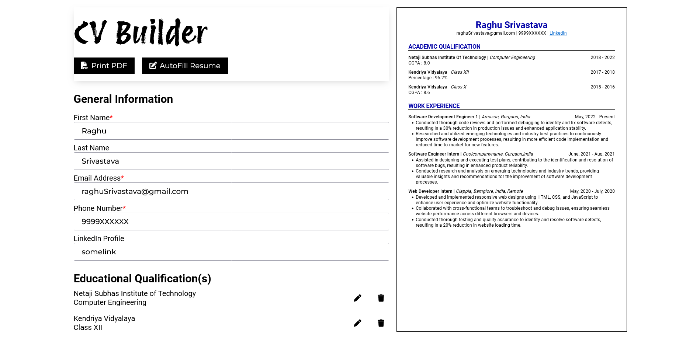

# CV Builder

This project was a assignment from [The Odin Project](https://www.theodinproject.com/lessons/node-path-react-new-cv-application). The aim was to build a mutipage Restaurant websites using javascript, and webpack for bundling.

## What is it?
This app builds Resume using the information you provide through forms. 
It collects :
- General Info : that include name and contact infos
- Education Info: that includes graduation or schooling details
- Work/Experience Info: that includes any internship or job experiences

[Live Preview](https://zingy-marshmallow-b54010.netlify.app/)

